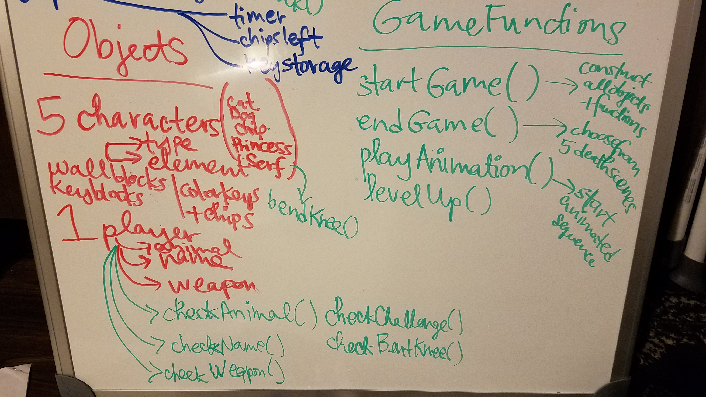

# Court's Quest

## Technologies used:
```
* HTML (very little): Form input
* CSS: media query (@font-face)
* Vanilla JS (object constructor)
* Pinterest for design images
* DaFont.com
* Trello for feature/task organization
```

## Approach taken:
* game solves a problem
* quest-style game
* design as inspired by the Museum of Islamic Art, Doha
* actual game play based on Chip's Challenge from the 90s

## Installation instructions:
* GH Pages link: https://courtneyfay.github.io/project-1/index.html

## Unsolved problems:
* reset button messes up the game on the next round!
* djinn disappears when she floats over a key or magic lamp

------------------------------------------------------------------------

## Other useful links:

Presentation slides: https://docs.google.com/presentation/d/1fr0p1JOh-NkQk7zv63wZupXTG1SXOEJsR2LuPV6_zGk/edit?usp=sharing

Trello board link: https://trello.com/b/IJeqbAsB/project-1-courts-quest

Pinterest link: https://www.pinterest.com/faycourtney/project-1-game/

Wireframe: 

ADTs: 




Chip's Challenge Level 1: 

Windows version of Chip's Challenge game link: https://classicreload.com/windows-chips-challenge.html

