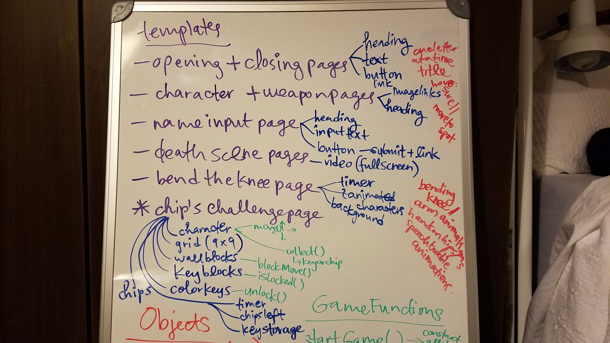

Technologies used:
--HTML (very little)
	--Form input
--CSS
--Vanilla JS

Approach taken:
--  

Installation instructions:
--link to gh pages!!

Unsolved problems:
--reset button messes up the game on the next round!
--djinn disappears when she floats over a key or magic lamp

Trello board link: https://trello.com/b/IJeqbAsB/project-1-courts-quest

Pinterest link: https://www.pinterest.com/faycourtney/project-1-game/

Wireframe: 

ADTs: 

Chip's Challenge Level 1: 

Windows version of Chip's Challenge game link: https://classicreload.com/windows-chips-challenge.html

